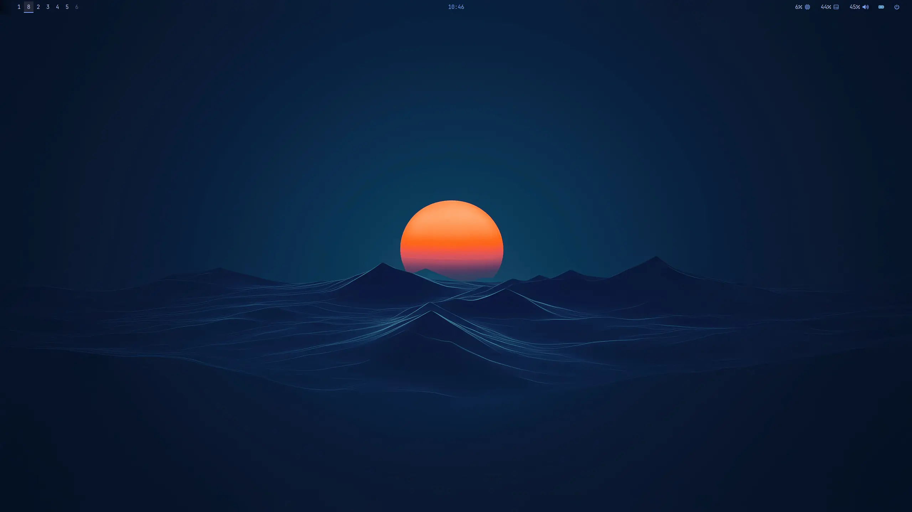
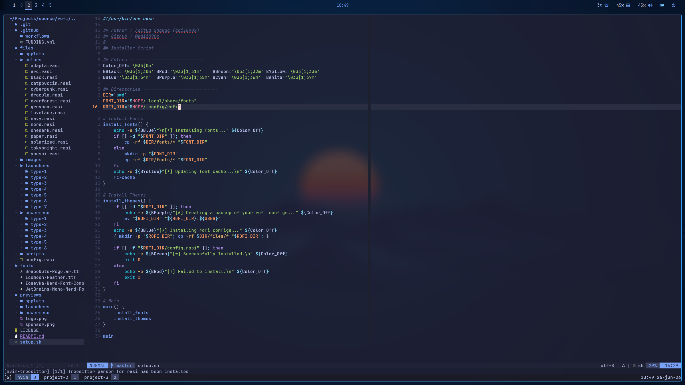
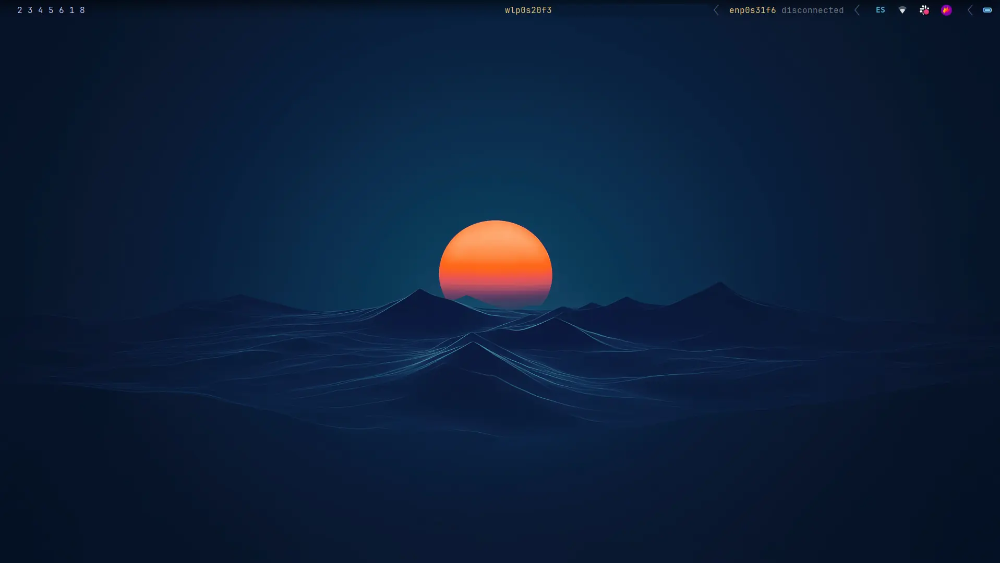

<div align="center">

# 🌅 dotfiles

**My Linux desktop, tuned to the keystroke.**

A reproducible i3 setup — window manager, bar, compositor, terminal, shell and editor —
installable on a fresh machine with a single Ansible playbook.




</div>

---

## ✨ Showcase

#### Editor — Neovim + Telescope, working on a rofi theme installer


#### Dual-monitor desktop
<table>
  <tr>
    <td></td>
    <td></td>
  </tr>
</table>

---

## 🧰 What's inside

| Component | Tool | Role |
|-----------|------|------|
| 🪟 Window manager | **i3** | Tiling layout, keyboard-driven workspaces |
| 📊 Status bar | **Polybar** | Workspaces, system stats, network, tray |
| 🖼️ Compositor | **picom** | Transparency, blur, shadows |
| 🐱 Terminal | **kitty** | GPU-accelerated, themed |
| 🐚 Shell | **zsh + oh-my-zsh** | Prompt, aliases, plugins |
| 🧩 Multiplexer | **tmux** | Sessions, panes, custom keybindings |
| 📁 File manager | **yazi** | Fast terminal file browser |
| 🚀 Drop-down terminal | **raise-terminal** | Quake-style toggle utility |
| 🔧 Scripts | `scripts/` | `pretty-diff`, `projects`, `rofi-thunar`, `tmux-rename`, `tmux-windownizer` |

Plus terminal color themes and a few quality-of-life helper scripts.

---

## 🚀 Installation

### Ansible (recommended)

Provisions everything on a fresh machine:

```bash
cd ansible
ansible-playbook install.yml
```

See [`ansible/README.md`](ansible/README.md) for details and available tags.

### Makefile (per-component)

Prefer to install pieces individually:

```bash
make install                  # full setup
make install-i3-config        # just i3
make install-polybar-config   # just Polybar
make install-raise-terminal   # drop-down terminal utility
make install-check            # verify what's installed
```

---

<div align="center">
<sub>Built for a fast, distraction-free, keyboard-first workflow. Steal anything you like. 🐧</sub>
</div>
